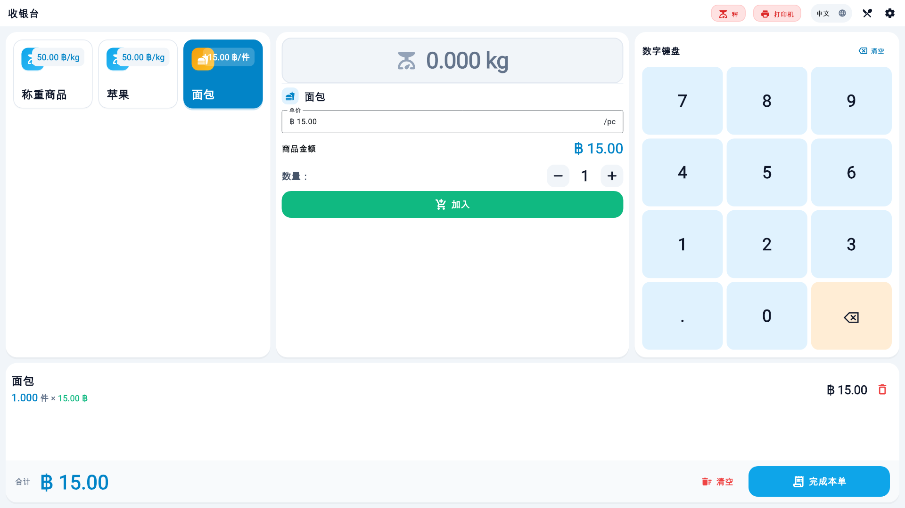
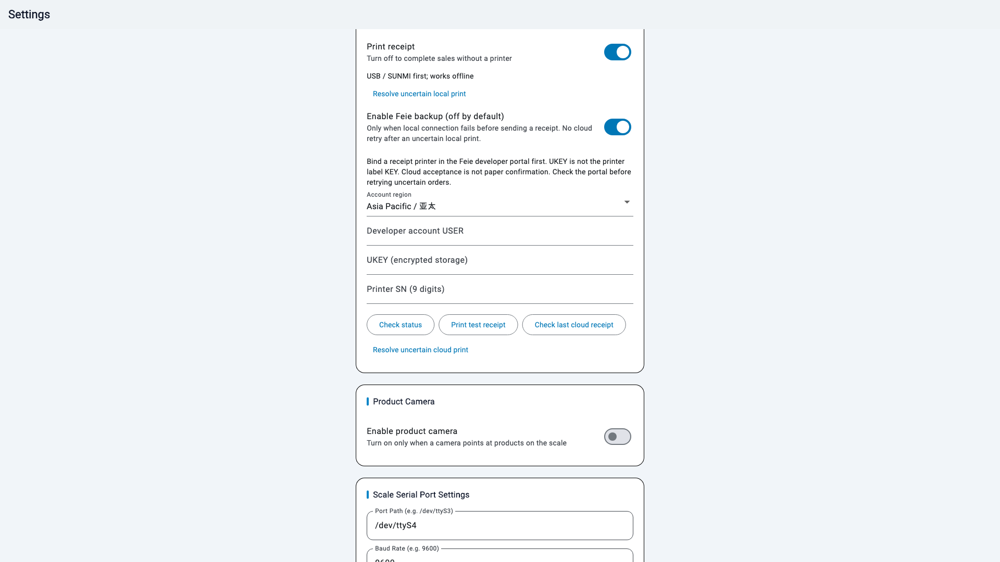
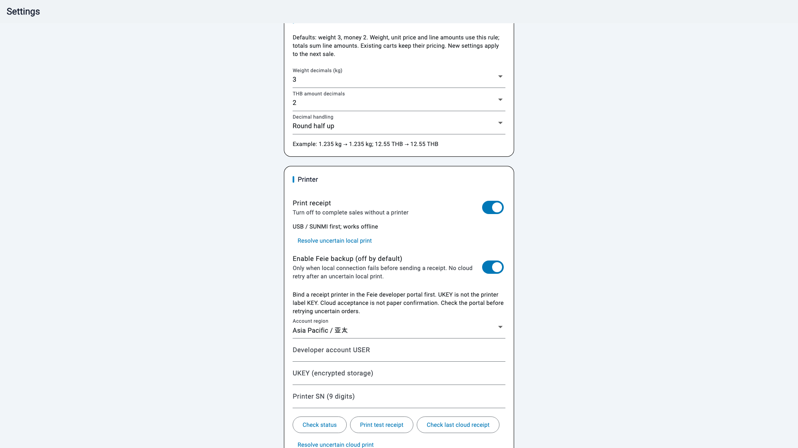

# Offline Scale V5

Android scale checkout with **local menus, a permanent price keypad and receipt printing**. Weighing and compatible local printing work without a server account. Optional Feie Cloud printing requires internet.

[中文](README.md) · [Printer compatibility](docs/PRINTERS.md) · [Feie integration](docs/FEIE-PLAN.md) · [Validation](docs/VALIDATION.md)

## Download

Get the APK and SHA256SUMS from [Releases](https://github.com/super-ai-company/offline-scale-v5/releases). Requires Android 7.0 / API 24 or later. A landscape POS display of 1280×800 or larger is recommended.

The app retains `com.vdamov3.cashier_trae` and the original signing certificate for in-place upgrades from v1.1.1. **Do not uninstall first**: uninstalling removes local menus and settings. The APK is a non-debuggable release build signed with the legacy Android Debug certificate to preserve compatibility. It is distributed by GitHub sideloading; store signing migration has not been completed. Consult release notes for actual hardware acceptance status.

## Features

- Offline weighing and piece-item checkout with gram precision and cent-rounded line totals.
- Quick weighing item selected at startup, permanent keypad and cart below the work area.
- Temporary sale prices do not overwrite menu prices; save a default weighing price separately.
- English, Chinese and Thai UI; compatible local printers render Unicode receipts as bitmaps.
- Configurable serial scale path and baud rate. Stable valid positive kg required for weighed sales; stale readings are invalidated.
- Tare and zero shown only for a compatible protocol, with command submission distinguished from scale response.
- USB 58 mm receipt adapter and SUNMI built-in printer adapter.
- USB/SUNMI always has priority. Feie backup has an independent switch, off by default; it runs only after local connection failure before receipt submission.
- Weight precision 0–3 digits (default 3), THB precision 0/1/2 (default 2), round half up or truncate; screens and receipts agree.
- Optional Feie Cloud settings: region, USER, encrypted UKEY, SN, status check, test receipt and last-order confirmation.
- No automatic cloud retry after lost replies. Persistent resend protection survives app restart.
- Product camera disabled by default; local recognition is experimental and requires dedicated hardware plus operator confirmation.

The app does not currently provide payment processing, a durable sales ledger, tax invoices or cloud synchronization. Thai cloud printer font support must be tested on the particular Feie device.

## Screenshots

Actual Flutter UI renders with demo data and mocked device input. These previews are separate from physical device acceptance.





## Setup

Serial defaults are `/dev/ttyS4` and 9600 baud. Test the actual device before use. USB support is limited to the adapter's recognized vendor IDs; it is not universal ESC/POS compatibility.

For Feie Cloud, bind a receipt printer in the matching regional developer portal first. Enter USER, account UKEY and the printer's 9-digit SN in Settings. Account UKEY is different from the device label KEY. Check status, print a test receipt, inspect paper, and save. The application encrypts UKEY with Android Keystore and does not embed credentials.

## Build

```sh
flutter pub get
flutter analyze
flutter test
flutter build apk --release
```

Verified build environment: Flutter 3.47.5 / Dart 3.13.4, existing Gradle 8.14 / AGP 8.11.1, Java 17 compatible bytecode. Output: `build/app/outputs/flutter-apk/app-release.apk`.

Derived from [lijingpan/cashiertraeV2, offline branch](https://github.com/lijingpan/cashiertraeV2/tree/codex/offline-ai), with source history retained. See [third-party notices](THIRD_PARTY.md).

## Precision



Integer THB mode removes fractional cash amounts. Weight, unit price and line amounts use the selected rounding rule; totals sum billed lines. Existing carts retain their pricing; changes apply to the next sale. For example, 12.55 THB rounds to 13 or truncates to 12 at zero decimals. Integer mode also quantizes unit prices.
