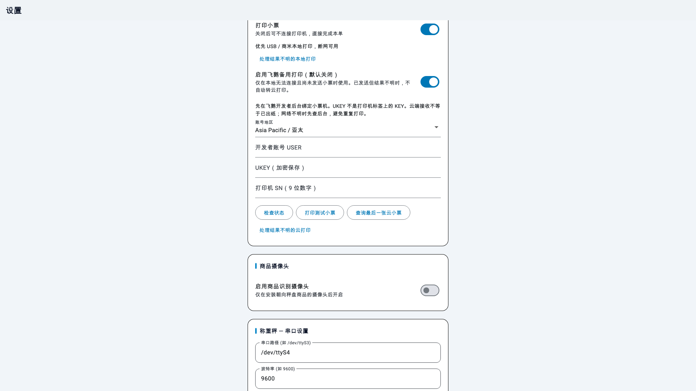
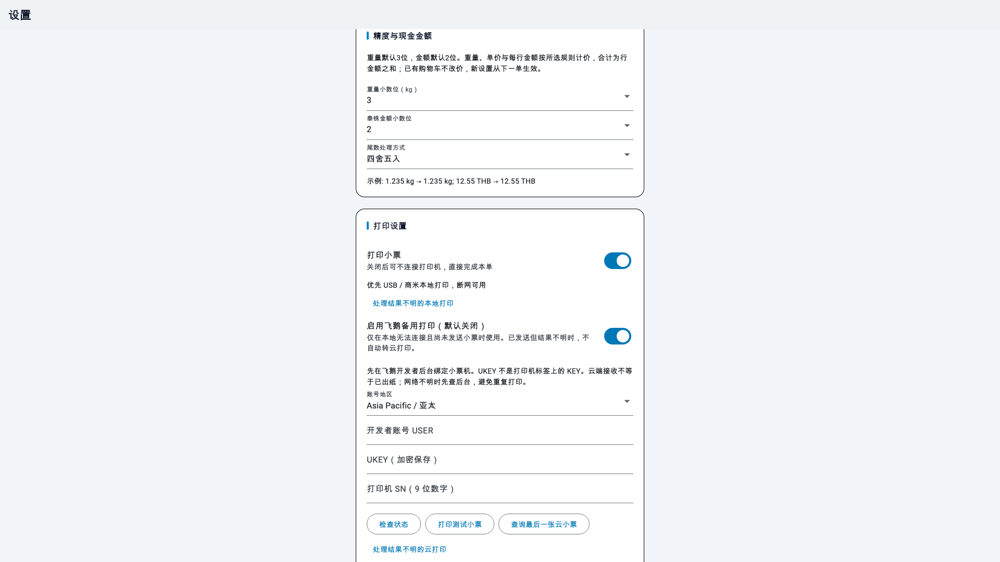

# Offline Scale V5 · 离线电子秤收银

**Android scale checkout with local menus, a permanent price keypad and receipt printing.**

**面向 Android 收银秤的离线称重收银：本地菜单、常驻数字键盘、购物车和小票打印。**

[English](README.en.md) · [打印机兼容说明 / Printers](docs/PRINTERS.md) · [飞鹅接入方案 / Feie plan](docs/FEIE-PLAN.md) · [验收记录 / Validation](docs/VALIDATION.md)

## 下载与安装

从本仓库 [Releases](https://github.com/super-ai-company/offline-scale-v5/releases) 下载 APK 和 SHA256SUMS。Android 7.0（API 24）及以上，推荐 1280×800 或更大的横屏收银设备。保留包名 `com.vdamov3.cashier_trae` 与旧版签名，兼容原 v1.1.1 覆盖升级；不要先卸载，卸载会删除本地菜单和设置。

当前 APK 沿用原项目的 Android Debug 证书，以保持已部署设备的升级兼容；构建类型为 release，应用不可调试。这是 GitHub 侧载分发方式，尚未迁移应用商店签名体系。硬件验收是否完成，以发布说明和验收记录为准。

## 功能

- 无账号、无后端即可进行本地称重收银，按克与分币计算、逐行舍入。
- 打开即选中通用称重商品，右侧数字键盘常驻；本单临时单价与菜单原价分开。
- 可管理称重或计件商品，提供中文、英文和泰文界面及本地小票。
- 兼容串口秤显示稳定重量；仅在协议支持时显示去皮和置零，失联或非 kg 数据阻止称重入单。
- 58 mm USB 位图小票、商米内置打印适配；可关闭打印后完成销售。
- 本地 USB / 商米优先，断网可用；飞鹅备用独立开关默认关闭，仅本地连接失败且未发送票据时备用。
- 重量精度 0–3 位（默认3）；泰铢金额 0/1/2 位（默认2）；支持四舍五入或截去尾数，屏幕与票据一致。
- 设置中可选飞鹅云：地区、USER、UKEY、SN、状态检查、测试小票、出纸确认查询。
- 飞鹅 UKEY 在设备上加密存储；云打印超时不自动重发，防止重复出纸。
- 商品摄像头默认关闭；本地识别属于实验功能，需专用摄像头和人工确认。

离线运行指本地收银和受支持的本地打印。**飞鹅云打印必须联网**，泰文字库需对具体云打印机验收。应用目前不提供支付网关、销售账本、税务发票或云同步。

## 界面预览

下图由实际 Flutter 界面渲染，使用演示菜单和模拟设备输入，不代表真机硬件验收。




## 快速设置

串口路径默认为 `/dev/ttyS4`，波特率为 9600；请按实际设备调整并测试。USB 仅适配已识别的厂商 ID，详情见兼容表，不支持所有标注 ESC/POS 的打印机。

飞鹅云先在对应地区的官方开发者后台绑定小票机，再在应用设置中填入账号 USER、账号 UKEY 与打印机 SN。UKEY 与打印机标签上的 KEY 不同。先检查状态、打印测试并核对纸张，再保存。禁止将账号凭据加入代码、截图或 issue。

## 开发

```sh
flutter pub get
flutter analyze
flutter test
flutter build apk --release
```

本次验收环境：Flutter 3.47.5 / Dart 3.13.4，JDK 17 兼容字节码，现有 Gradle 8.14 / AGP 8.11.1。发布包位于 `build/app/outputs/flutter-apk/app-release.apk`。硬件源码位于 `android/app/src/main`，云打印实现位于 `lib/services/feie_service.dart`。

## 来源与第三方组件

离线版本来源于 [lijingpan/cashiertraeV2](https://github.com/lijingpan/cashiertraeV2/tree/codex/offline-ai)，原发布为 [v1.1.1](https://github.com/lijingpan/cashiertraeV2/releases/tag/v1.1.1)。本仓库保留来源 Git 历史。串口与 USB 打印 AAR、SUNMI SDK、MediaPipe 与显示插件分别保留其归属；见 [第三方说明](THIRD_PARTY.md)。公开源码不自动改变第三方组件的许可。

## 精度设置



金额选0位可收整泰铢，选1位或2位可显示角/分。重量、单价、每行金额按选择规则计算，合计为行金额之和。已有购物车保留入单价格，新设置从下一单生效。例：12.55 THB 在0位四舍五入为13，直接截去为12。整数金额模式也将单价按相同规则处理。

### 在线更新与飞鹅交接

v1.2.2 起，在「设置 → 应用更新 → 检查更新」手动获取公司 GitHub 最新正式版。确认下载后校验 SHA-256、包名、原签名和递增版本号，再打开 Android 安装确认；首次可能需要允许“此应用安装未知应用”。取消或下载失败不改现有应用与数据。请结束当前订单再更新，不要卸载。检查更新不会在启动或离线收银时自动联网。

[飞鹅接入交接 skill](docs/skills/feie-offline-scale/SKILL.md)。共享本机参数从原登记读取，公共文档不包含个人账号或 UKEY。用户已于2026-10-02确认v1.2.1断网本地打印正常。
